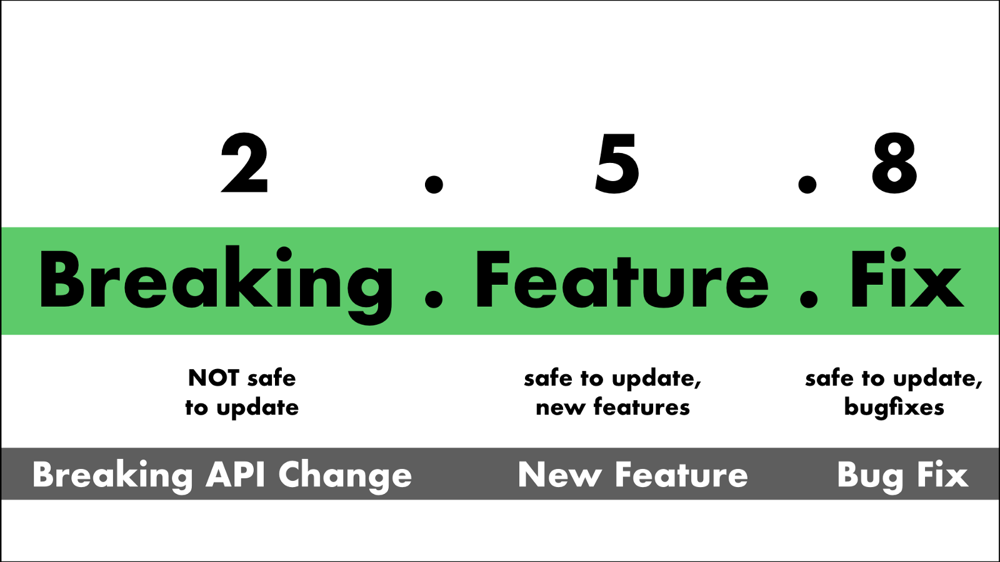

# SemVer Bad

## SemVer Bad

SemVer is a great theoretical idea, with a horrible execution strategy for teams who desire to follow CI/CD practices. Just so we all know what is being discussed, here is the basics of SemVer:



Tools like NodeJS, Ruby, and Python have built their toolchains around this contract. That is, when you import a dependency, it will often show up like this \(with NPM\):

```
"node-tool-lib": "^0.1.3"
```

Now, this syntax tells us that we can, at any time, pick up a version of \`node-tool-lib\` from 0.1.3 to &lt;1.0.0. So, why is this a problem?

### By Robots, For Robots

SemVer is designed to be used as an indicator of compatibility and functionality; the numbers have rigid meanings. The argument goes that a major release is the only time backwards-incompatible changes are made, thus indicating safety in upgrading the minor- and patch-level as available. But this means that multiple things need to be true at the same time:

1. You have a well-defined contract, and a well-defined place that contract is applied.
2. You are able to enforce the contract through programatic means, such as testing
3. You absolutely must bump the major version on an incompatibility, no matter how slight
4. The major version number is only incremented programmatically based upon your contract.

Now, almost nobody has \(1\) and \(2\) -- and no, JSON Schema validation is not sufficient for this purpose. Contracts are not just the shape of the data, but also the required order of operations as well as the exceptional code paths. Item \(3\) is a critical feature we'll discuss in a moment, but item \(4\) is how you maintain compatible with SemVer. No human developer is perfect. If we rely on humans to decide what constitutes a breaking change, we will invariably end up in a situtation where a developer thought they fixed a small bug, only bumped the patch, but actually introduced a new bug that wasn't caught by the automated testing framework.

### Not CI/CD Compatible

Using SemVer-based ranges for dependencies means that your build process is not strictly repeatable. It depends upon the availability of updates to your dependencies, thus dependent upon time of day that the build is executed. Old code that previously worked with thorough testing may no longer work if built a few days later. This happens because some developers aren't as strict with their SemVer as they should be. Other developers decided they didn't like SemVer, and refused to be bound by it. [You can guess how that went](https://github.com/jashkenas/underscore/issues/1805). Lockfiles are a poor band-aid for a "design feature". One thing I insist on in my projects is that every version is exactly pinned. No SemVer ranges, no \`-SNAPSHOT\` dependencies, etc. In NPM, one can enforce this with the \`--save-exact\` flag when running \`npm install\`.

### Zero-Dot

So what is a 0.y.z release? SemVer tells us that: 

> Major version zero \(0.y.z\) is for initial development. Anything may change at any time. The public API should not be considered stable  
>  - [https://semver.org/\#spec-item-4](https://semver.org/#spec-item-4)

Thus, if a dev depends on package 0.y.z in a SemVer range, you should plan on receiving breaking changes. That's not very helpful. How many projects sit out there at 0.y.z forever? 

In a strictly pedantic sense, you can't claim to do SemVer until you have a 1.y.z release. 0.y.z releases are just a beginning state, not a public availability state. 

### What does Compatibility Mean

Notice in most large nodejs repositories, authors pin their dependencies to exact versions. This is to get away from the problems that SemVer introduced. 

Pop quiz: How are devs bumping the major version number? Remember what SemVer says:

> Major version X \(X.y.z \| X &gt; 0\) MUST be incremented if any backwards incompatible changes are introduced to the public API.  
> - [https://semver.org/\#spec-item-8](https://semver.org/#spec-item-8)

 To answer this effectively, we must strictly define what constitutes compatibility. Earlier in the document, this is what they say about the patch-level version:

> Patch version Z \(x.y.Z \| x &gt; 0\) MUST be incremented if only backwards compatible bug fixes are introduced. A bug fix is defined as an internal change that fixes incorrect behavior.  
> - [https://semver.org/\#spec-item-6](https://semver.org/#spec-item-6)

This sentiment is intuitive and obvious. However, remember that we are saying that those who depend on us may automatically upgrade safely in the patch-level. 

SemVer declares the public API as what you're versioning. Let's imagine, however, that there's a change to your 500 error response. Instead of just sending a JSON document like below:

`{ "error": "500", "cause": "Some error occurred"}`

Then, you want to enhance the output to also include a tracing id that can be used for later analysis:

`{ "error": "500", "cause": "Some error occurred", "trace": "13eb8a9"}`

This, by definition, breaks the output contract, right? Or, did your contract specify that clients should accept all new fields? The default behavior on extra fields changes between libraries. Some throw exceptions, others silently swallow the extra data. Thus, what "backwards compatible" means is specific to the implementers of your API. 

Arguably, any change in outputs from the universe of inputs is a public-facing, non-backwards-compatible change. Thus simply adding this field to your outputs constitutes a major version bump. Without tools specifically designed to enforce the contracts, you may never know if a major bump was needed.

This therefore usually leaves to humans who decide that a bump is needed, based on some abstract concept of compatibility. Without a strict compatibility test, this process will fail, given enough time.

### Your Major Version Sucks

So you're all-in on SemVer. You have your contracts, you have your contract tests, you have a CI system that can divine the major/minor/patch-level changes. Now, you're faced with a new problem: You will invariably be bumping your major version far more than most folks would like. You should be expecting a major version with 3 or 4 digits. NVidia's graphics drivers are relatively famously large-versioned \(but strictly not SemVer\). At the time of writing, the latest driver was version \`417.21\`. Without a patch level, however, this is not SemVer.

This leads to two schools of thought. Some folks claim that the major version is more of a marketing/effort construct, and that you can do SemVer with just the last two digits. Again: this isn't SemVer. SemVer's primary rule, in my opinion, is that the major version number indicates compatibility.

Others think that it's fine to continually bump the major version number, and there's no big issue with having major version numbers in the hundreds \(\`339.0.1\`\) or thousands \(\`1317.3.19\`\). I argue that this is actually the only true version of SemVer. However, this assumes that you have the contracts in place and verified. Not only is it not enough for a developer to make a judgement call, having a human bump the major version is not strictly SemVer.

The sad reality is, most who claim to be doing SemVer aren't doing SemVer. They don't actually have their compatibility contracs being enforced, much less even existing. Without a non-human arbiter of truth, this SemVer-lite is just another iteration of manual versioning, but with a lot more risk for downstream dependencies due to the implied safely

### Compatibility Effort

So given my assertion that the only folks who truly do SemVer will necessarily have major version numbers that grow much larger than most are used to, what is the benefit of SemVer? Yes, you can say you want \`113.x.x\` and probably get the right thing. However, how do we know how much effort it will take for downstream dependencies to update major versions? In a project with traditional versioning, I know that going from version 2 to version 3 will mean big changes, possibly some code fixes, possibly complete re-workings of parts of my codebase. With SemVer, this level of change is at the same level as a small bug fix or inconsequential data shape change.  
Downstream users then have to go through and look at all the major version bumps, and actually read the release notes, for potentially hundreds or thousands of major versions, and determine what adaptations are needed in their code.

### The CI/CD Alternative

While some developers have taken to what has been humorously called \[Sentimental Versioning\]\(http://sentimentalversioning.org/\). Basically, developers still follow the old way of the major version being a marketing construct, then try to enforce compatibility on the feature- and patch-level version. This seems inferior, but it also gives downstream users a conceptual idea of how big the change is. When Angular went from Angular 2 to Angular 4, it was a clear message to the community that \*this new thing is really different\*. There's an explicit declaration of integration efforts. I can be relatively certain that \`2.0.1\` and \`2.0.10\` will \*probably\* be interchangeable. But it's not guaranteed through an automated, robotic means, and thus building your product around auto-upgrading SemVer ranges introduces surface area for tricky regressions.

My preferred versioning scheme is specific to CD pipelines, but as a proponent of CI/CD, I think you should adopt it anyway! So in this world, we don't care about major-minor-patch. We're just delivering iterations of the same product. We have an integration environment for the specific purpose of testing with dependencies. In this case, all that really matters is that you have a unique version for your automated deployments to use. In my preference, the version is exactly the build number in the CI system of your choice. This has some nice side effects: You can immediately tie a version back to the build that created it; The number is monotonically increasing, indicating directionality of progress. Another potential is to simply use the git hash of the commit as your version. While this can work with tools, it doesn't really indicate directionality of progress nor does it indicate which build is newer without additional metadata.


